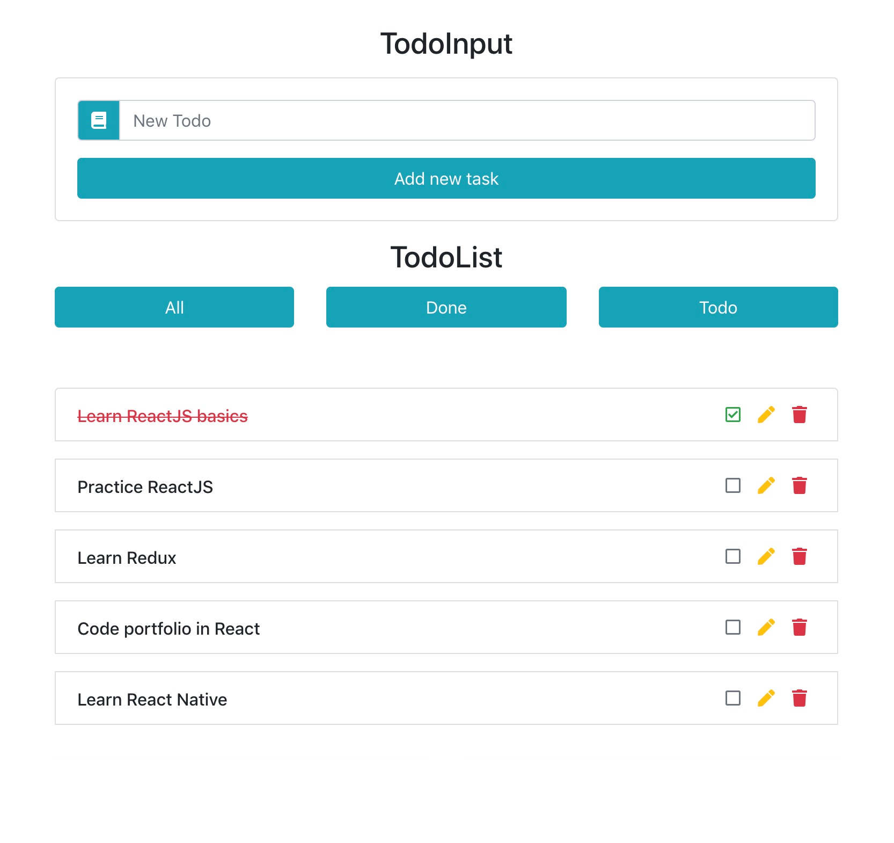

## Angular - Todo List

### Execução do projeto

1. Faça instalação de dependências `npm i`
2. Execute a aplicação com `npm start`
3. Para testes execute `npm test`

---
### Detalhes

Este projeto consiste em um desafio de programação com o objetivo de desenvolver uma aplicação Angular para gerenciar listas de tarefas (Todo List), seguindo as melhores práticas de desenvolvimento.

---
### Seu objetivo

#### Funcionalidades

- Listar todos os todos
- Editar os todos
- Deletar os todos
- Adicionar novo todo
- Filtrar os todos como "todos", "completos" e "incompletos"

#### Estrutura

- Fique à vontade para organizar o projeto da forma que achar melhor.

#### Ícones

- Utilize a biblioteca pré-instalada `@ng-icons/core` em conjunto com `@ng-icons/heroicons`.
- Documentação oficial disponível [aqui](https://github.com/ng-icons/ng-icons).
- Coleção de ícones do Heroicons disponível [aqui](https://heroicons.com/).

**Testes**

- Crie os testes unitários para seus componentes e serviços.

---
### Detalhes da API interna

#### Detalhes

- **URL Base:** https://api.fake.com
- **Métodos Utilizados:**
  - `GET`: `https://api.fake.com/todos` ou `https://api.fake.com/todos/<id>`
  - `POST`: `https://api.fake.com/todos`
    - Parâmetros possíveis do corpo da requisição:
      - title: string
  - `PATCH`: `https://api.fake.com/todos/<id>`
    - Parâmetros possíveis do corpo da requisição:
      - completed: boolean
      - title: string
  - `DELETE`: `https://api.fake.com/todos/<id>`
  - `GET / Filter`: `https://api.fake.com/todos?completed=false`

#### Retorno

```json
[
  {
    "id": 2,
    "title": "Cuidadar da planta",
    "completed": false
  },
  {
    "id": 4,
    "title": "ler as notícias",
    "completed": false
  }
]
```

---
### Resultado final

**Observação:** O layout é apenas ilustrativo. Sinta-se à vontade para melhorá-lo ou criar algo semelhante.

